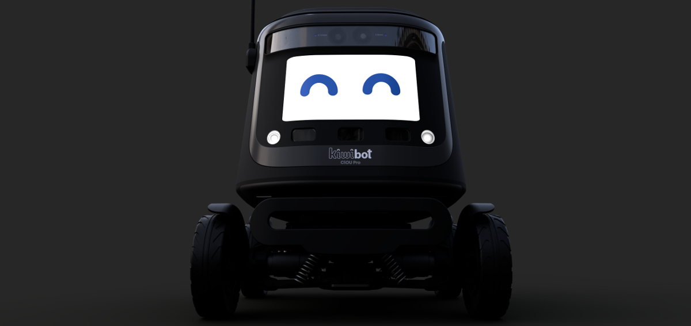

# **Medusa Project**

  

Since early stages **Kiwibot** has shown amazing ideas, strategies and developments to propose a new way to perform the last mile delivery, all of that was embodied in a single box (Our first version); however, over the years and different versions we improved significantly in our logistics, operations, design and specially the software by using not only pure Robotics but Artificial Intelligence as well. At this stage we are ready to perform new and astonishing developments for our industry as a world leading company in the last mile delivery with Robots with a new version.

**Medusa Project** will contain within an amazing development environment all the software for the new version of the Kiwibot. By providing a completely new development environment with the most powerful tools for our developers, we will be able to focus on what is important for us: Make the best Kiwibot you've ever seen. We want to give a step forward in every single aspect to keep our little friend at the very top in this field.

---
## **Motivation**
We have been recollecting and reusing many old scripts from the last two Kiwibot versions (Rover and Apollo), which has led to a considerable technical debt. With that factor in mind with this project we want to provide a wide range of advantages as stated below:

  * The base image and the requirements are allocated in the same repository.
  * The package requirements are managed in the right way (Good practices).
  * An easy way to contribute and develop packages for Kiwibot 4.0 which is ROS 2 based.
  * An easy and fast setup for installation of developer tools within a Dev Container for VS Code.

---
## **Project architecture**
Find the distribution of the project in the next list:

- **media:** Media elements to be used in the container
- **rover:** Main folder where most of the source code is located
   - **balena_configs**
   - **configs**
   - **data**
   - **packages:** Download script for searching and decompressing the Nvidia packages to build GPU containers for Balena. Cuda DNN (cuDNN) is included here.
   - **ros2:** Development workspace
      - **src:** ROS 2 packages 
   - **Dockerfile:** Dockerfile built in Balena Cloud Build Server
- **ssh-keys**

Find useful information of: 
- [Balena](https://www.balena.io/what-is-balena/): Balena primer (Good overall description about this incredible platform).
---
## **Requirements**

A recommendation is to use [VS Code](https://code.visualstudio.com/) as the main IDE for development. Also:

   1. [docker-ce](https://docs.docker.com/install/)
   2. [docker-compose](https://docs.docker.com/compose/install/)

And for the extensions required:

   1. [Remote development](https://marketplace.visualstudio.com/items?itemName=ms-vscode-remote.vscode-remote-extensionpack)

As far for installation requirements, the required secrets should be present in:

   1. `balena_cli_configs/token` --> Token so that `balena-cli` can work without problems. Get it on [balena access-tokens page](https://dashboard.balena-cloud.com/preferences/access-tokens)
   2. `ssh-keys/id_balena` and `ssh-keys/id_balena.pubkey` --> Pair of ssh keys that should be registered in [balena cloud](https://dashboard.balena-cloud.com/preferences/sshkeys)

Please stick to the provided names, otherwise it won't work as out-of-the-box. Also **DO NOT ADD SECRETS TO THE REPO**.

### **Add-ons Provided**
We are providing the [balena staged-releases](https://github.com/balena-io-projects/staged-releases) as a `git submodule`, you can init the submodule and change the required variables in:

   * `staged-releases/balena.env`

---
## **Running our stack**
Find a brief explanation on how to run our stack in your IDE and the explanation of the launch file as this is the key to manage which nodes are going to be launched.

### **Python script bot.launch.py**
This script contains the nodes information and arguments within our ROS 2 development workspace in order to launch them in a single command (ros2 launch <name>). Please note that this is the standard form to launch nodes in ROS 2.

   - Vision nodes
      - NODE_VIDEO_MAPPING
      - NODE_VIDEO_CALIBRATION
      - NODE_VIDEO_PARTICLE
      - NODE_LOCAL_CONSOLE

   - Control nodes
      - NODE_CANLINK_CHASSIS
      - NODE_CANLINK_CABIN
   
   - Local client node
      - NODE_LOCAL_CLIENT
   
   - Data capture node
      - NODE_DATA_CAPTURE

Set the `default` argument to 1 or 0 to launch a node (Within the described file). This can also be set at `nodes_local_launch.yaml` which will be created when you run the `startBot.sh` script.

### **Bash script startBot.sh**
In order to launch locally (Inside your IDE), please locate into the`configs/` folder and please execute the following bash command.

> bash startBot.sh start

This bash performs the following steps to launch the Kiwibot stack:

1. Sources the `local_env_vars.sh` which contains the Kiwibot local environment variables. 
2. Creates a local configuration file for the cameras.

For ROS 2 development workspace

1. Sources ROS Dashing and clean the older development workspace.
2. Builds the development workspace at `rover/ros2/`
3. Sources the resulting setup in the install folder `. install/setup.bash`
4. Downloads and runs the SocketIO server for Kiwibot local console.
5. Executes `ros2 launch /configs/bot.launch.py`

---
## **Kiwibot**
[Kiwibot](https://www.kiwibot.com/) links on-demand customers with you, we move atoms from point A to B in a safe, efficient, and affordable way.

We are improving people's lives with the world's most affordable and technologic delivery service for local commerce around the world, Since our start in 2017, Kiwibot has made over 90,000 deliveries and built over 200 robots to be the number one robot delivery platform on earth.

 

### **Our Engineering Team**
Meet our incredible team in charge of designing, building, manufacturing and giving life to our most loved friend the Kiwibot.

- **Designer**

   - Alejandro Otalora [Head designer] 
      - [LinkedIn](https://www.linkedin.com/in/alejandrootalora/)

- **Manufacture** 

   - Natalia Pinilla [Manufacture manager]
      - [LinkedIn](https://www.linkedin.com/in/natalia-andrea-pinilla-rivera-5214ab91/)
   - Leonardo Correa [Mechanical designer]
      - [LinkedIn](https://www.linkedin.com/in/leonardo-correa-853b30aa/)
   - Andres Rengifo [Electronic designer]
      - [LinkedIn](https://www.linkedin.com/in/andresr8/)
      - [Github](https://github.com/andresR8)

- **AI and Robotics**
   - David Cardozo [Former AI Team Leader - AI expert]
      - [LinkedIn](https://www.linkedin.com/in/davidcardozo/)
      - [Github](https://github.com/Davidnet)
   - John Betancourt [AI Team Leader - Computer vision]
      - [LinkedIn](https://www.linkedin.com/in/john-betancourt-345557129/)
      - [Github](https://github.com/JohnBetaCode)
   - Marcela Gomez [QA and testing]
      - [LinkedIn](https://www.linkedin.com/in/marcela-gomez-cardona-7b2190161/)
   - Camilo Alvis [Control and Robotics]
      - [LinkedIn](https://www.linkedin.com/in/camiloalvis/)
      - [Github](https://github.com/kmilo7204)

There is also a huge team out of the engineering area which gives a lot of work for our Kiwibot. Even if they are not listed here, they are the key to achieve our goals as a company.

---
## **Contributing**

### Code of conduct
We welcome contributions from everyone, and to ensure our community stays open and healthy we adhere to the Contributor Covenant, a widely used code of conduct adopted by many other communities such as Linux, Ruby on Rails and GitLab.

Everyone participating in the Kiwibot development is expected to follow the code of conduct. If someone in the community happens to be violating these terms, please let the project leads know, and we will address it as soon as possible.

---
## **Support**

Please feel free to contact any of our developers for any questions and help, we will be more than happy to help you:

* Camilo Alvis: `camiloalvis@kiwicampus.com` 
* David Cardozo: `david@kiwicampus.com` 
* John Betancourt: `john@kiwicampus.com` 